# Freelanceo — Features & User Flows

> Product + engineering reference. Each section describes a feature, the actors
> involved, a **drawn flow diagram**, the step-by-step behaviour, the notifications it
> raises, and the backend endpoints that power it.
>
> Diagrams are written in **Mermaid** — they render automatically in GitHub, GitLab,
> VS Code (Markdown preview), Notion, and Confluence. To share as Word/PDF, export this
> file from VS Code or paste into a Mermaid-aware doc tool.

**Stack:** React (frontend) · FastAPI (backend, `/api`) · MongoDB/Cosmos (data) · JWT +
session-cookie auth · Stripe (subscriptions). Payments for project milestones are
currently **tracked only** (no money movement yet — Stripe escrow is a future phase).

---

## 1. Feature Inventory

| # | Feature | Primary actor | Status |
|---|---------|---------------|--------|
| 1 | Sign up / registration (client or freelancer) | Guest | Live |
| 2 | Login (email + Google OAuth) | Guest | Live |
| 3 | Freelancer onboarding (build profile) | Freelancer | Live |
| 4 | Client onboarding (company profile) | Client | Live |
| 5 | Browse talent (gated preview for guests) | Guest / Client | Live |
| 6 | Freelancer profile, portfolio & reviews | All | Live |
| 7 | Follow a freelancer | Logged-in user | Live |
| 8 | Post a job (multi-step wizard) | Client | Live |
| 9 | Browse jobs (gated preview for guests/unsubscribed) | Freelancer | Live |
| 10 | Apply to a job with a proposal | Freelancer | Live |
| 11 | Review applicants → shortlist / decline / hire | Client | Live |
| 12 | Direct hire request (from a profile) | Client | Live |
| 13 | Contract: terms & milestone negotiation | Client + Freelancer | Live |
| 14 | Milestone lifecycle (fund → submit → approve → release) | Client + Freelancer | Live |
| 15 | My Jobs (client) & My Applications (freelancer) tracking | Client / Freelancer | Live |
| 16 | Messaging between users | All | Live |
| 17 | Social feed (posts, likes) | All | Live |
| 18 | Notifications + bell | All | Live |
| 19 | Reviews & ratings | Client → Freelancer | Live |
| 20 | Subscription / membership (Stripe) | Freelancer | Live |
| 21 | Admin console (users, jobs, categories) | Admin | Live |

---

## 2. Roles

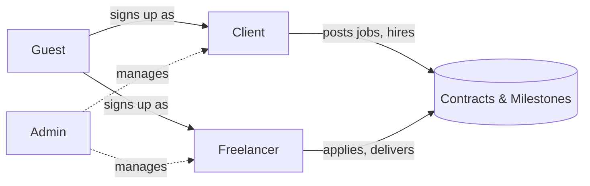

- **Guest** — not logged in. Sees limited previews of talent and jobs.
- **Client** — posts jobs, reviews applicants, hires, funds & approves milestones.
- **Freelancer** — builds a profile, applies to jobs, delivers milestones.
- **Admin** — platform management.

---

## 3. Sign-up & Authentication

**Actors:** Guest → becomes Client or Freelancer.

### 3.1 Sign-up flow

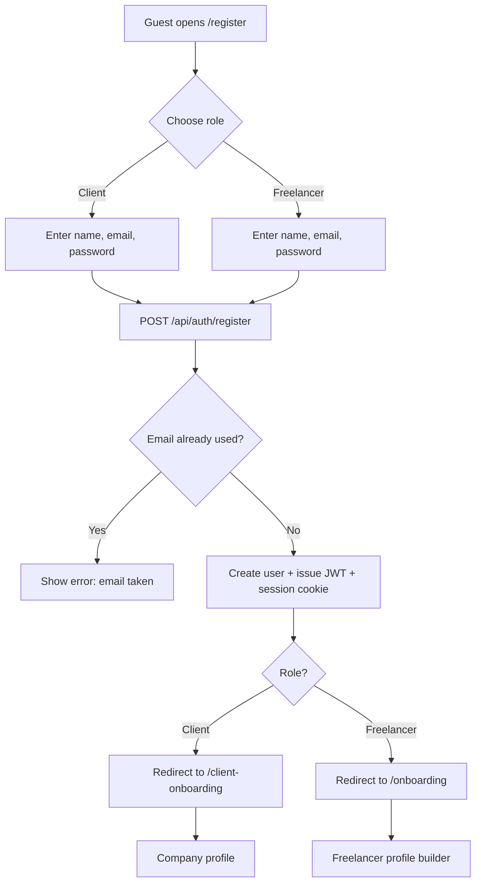

**Google OAuth:** alternative sign-in that creates/links a user via
`POST /api/auth/google-session`, then follows the same onboarding branch.

**Steps**
1. Guest picks **Client** or **Freelancer** on `/register`.
2. Submits name, email, password.
3. Backend rejects duplicate emails; otherwise creates the user, hashes the password,
   returns the user and sets a 7-day session cookie + JWT.
4. New clients go to company onboarding; new freelancers go to the profile builder.

**Endpoints:** `POST /api/auth/register`, `POST /api/auth/login`,
`POST /api/auth/google-session`, `GET /api/auth/me`, `POST /api/auth/logout`.

---

## 4. Onboarding

### 4.1 Freelancer onboarding

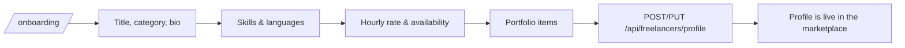

### 4.2 Client onboarding

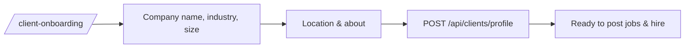

**Endpoints:** `GET/POST/PUT /api/freelancers/profile`,
`GET/POST/PUT /api/clients/profile`, `PUT /api/auth/me`.

---

## 5. Discover Talent (Browse Freelancers)

**Actors:** Guest (gated), Client, Admin.

```mermaid
flowchart TD
    A[/freelancers list] --> B{Logged in?}
    B -->|No guest| C[Preview only: title + rating, rest blurred + Sign-up CTA]
    B -->|Yes| D[Full cards: name, rate, skills, bio]
    D --> E[Filter by category, country, search by name/skill]
    D --> F[Open /freelancers/:id profile]
    F --> G[Portfolio, reviews, follow, message, hire]
```

- **Gating:** the backend **redacts** freelancer data for guests (`preview_only`), so it's a
  real gate, not just visual blur.
- **Search & filters:** category, country, and free-text (matches name/title/skills).

**Endpoints:** `GET /api/freelancers` (filters + guest redaction),
`GET /api/freelancers/featured`, `GET /api/freelancers/{id}`,
`GET /api/freelancers/countries`, `GET /api/freelancers/categories`.

---

## 6. Follow a Freelancer

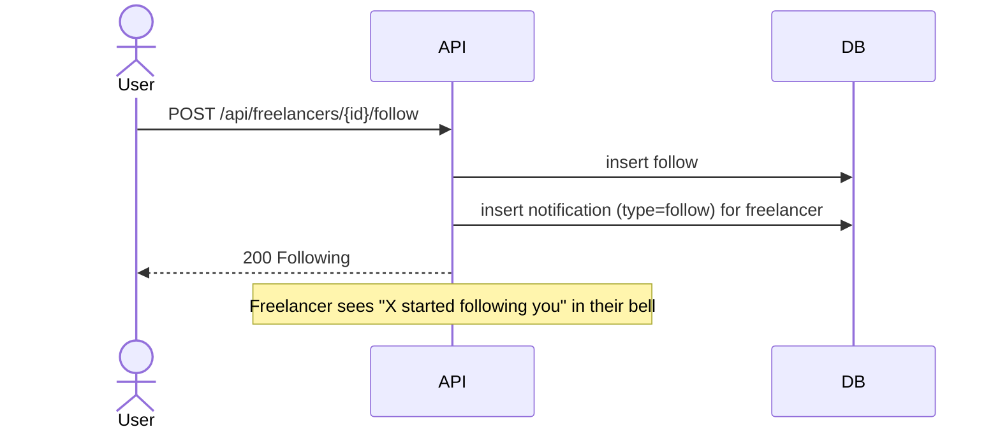

**Endpoints:** `POST/DELETE /api/freelancers/{id}/follow`,
`GET /api/freelancers/{id}/is-following`, `GET /api/following`.

---

## 7. Post a Job

**Actor:** Client. Multi-step wizard.

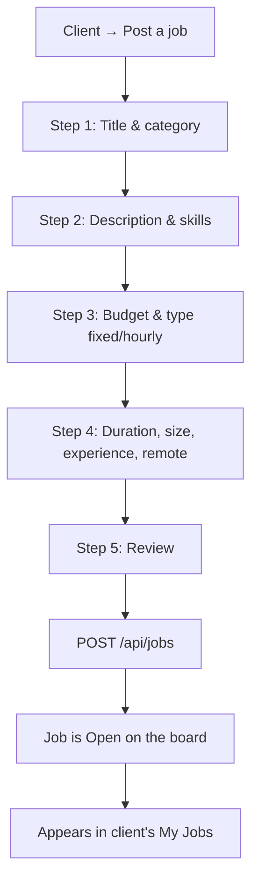

**Endpoints:** `POST /api/jobs`, `GET /api/jobs/my-jobs`, `PUT /api/jobs/{id}`,
`DELETE /api/jobs/{id}`.

---

## 8. Browse Jobs (Job Board)

**Actors:** Freelancer (full when subscribed), Guest/unsubscribed (gated).

```mermaid
flowchart TD
    A[/jobs board] --> B{Viewer}
    B -->|Guest| C[Titles only, rest blurred + Sign-up CTA]
    B -->|Freelancer no sub| D[Titles only + Subscribe CTA]
    B -->|Freelancer subscribed| E[Full job cards]
    E --> F[Open /jobs/:id]
    F --> G[Full description, budget, client, Apply]
```

**Endpoints:** `GET /api/jobs` (guest/sub gating), `GET /api/jobs/featured`,
`GET /api/jobs/{id}` (owner client also gets full access to review applicants).

---

## 9. Apply to a Job (Proposal)

**Actor:** Freelancer.

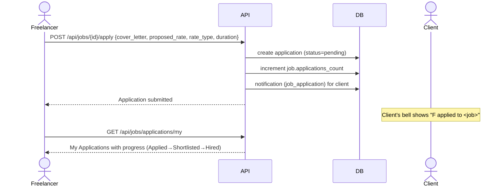

**Endpoints:** `POST /api/jobs/{id}/apply`, `GET /api/jobs/applications/my`,
`PUT /api/applications/{id}` (freelancer can `withdraw`).

---

## 10. Review Applicants → Hire

**Actor:** Client (job owner).

```mermaid
flowchart TD
    A[Client opens own job /jobs/:id] --> B[Sees applicant list + proposals]
    B --> C{Action per applicant}
    C -->|Shortlist| D[PUT /api/applications/id status=shortlisted]
    C -->|Decline| E[PUT /api/applications/id status=declined]
    C -->|Message| F[/dashboard/messages]
    C -->|Hire| G[POST /api/jobs/jid/applications/aid/hire]
    D --> H[Freelancer notified: shortlisted]
    E --> I[Freelancer notified: declined]
    G --> J[Create ACTIVE contract linked to job]
    J --> K[Freelancer notified: You've been hired]
    J --> L[Redirect client to contract to set terms]
```

**Endpoints:** `GET /api/jobs/{id}/applications`, `PUT /api/applications/{id}`,
`POST /api/jobs/{jid}/applications/{aid}/hire`.

---

## 11. Direct Hire Request (from a profile)

**Actor:** Client initiates without a job posting.

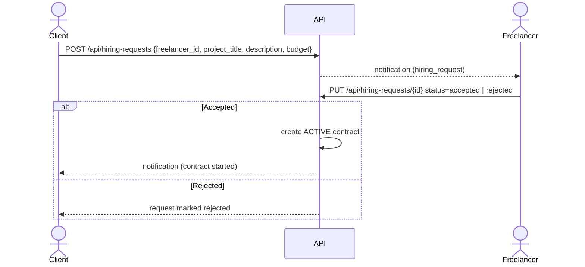

**Endpoints:** `GET /api/hiring-requests`, `POST /api/hiring-requests`,
`PUT /api/hiring-requests/{id}`.

---

## 12. Contract — Terms & Milestone Negotiation

Both the **hire** path (§10) and the **hire request** path (§11) create a **contract** in
`agreement_status = negotiating`. Either party then proposes terms; the other accepts.

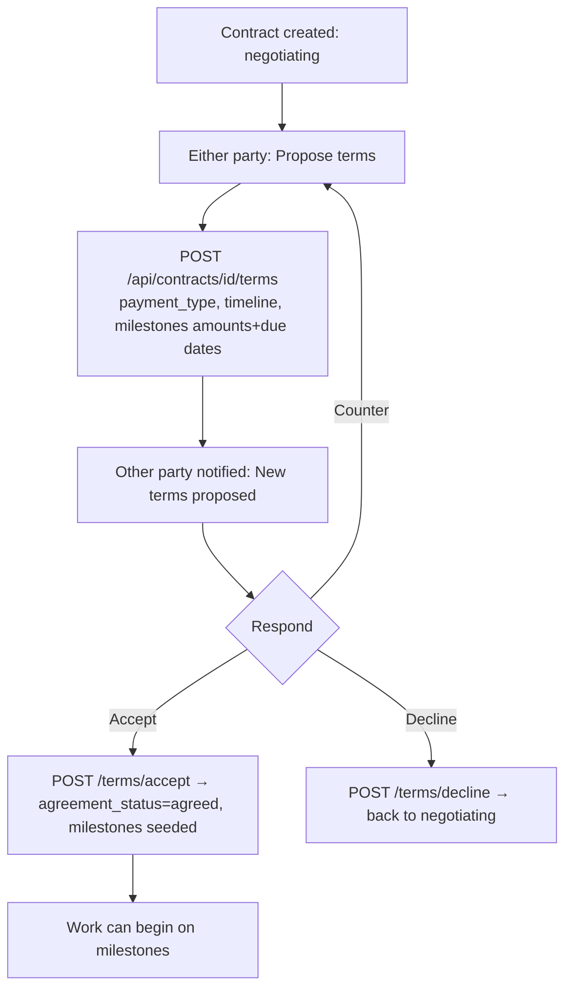

**Endpoints:** `POST /api/contracts/{id}/terms`, `POST /api/contracts/{id}/terms/accept`,
`POST /api/contracts/{id}/terms/decline`, `GET /api/contracts`,
`GET /api/contracts/{id}`.

---

## 13. Milestone Lifecycle

Once terms are **agreed**, each milestone runs through this lifecycle. Payments are
**tracked only** (no funds move yet).

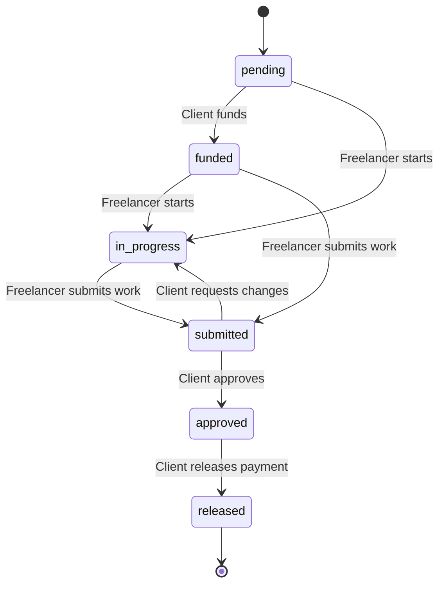

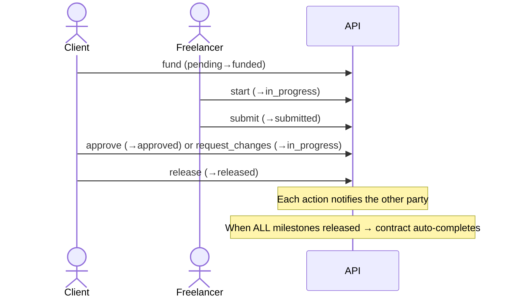

**Rules (role-gated):** fund/approve/release/request_changes = **client**;
start/submit = **freelancer**. Invalid transitions are rejected.

**Endpoint:** `POST /api/contracts/{id}/milestones/{mid}/action` with
`action ∈ {fund, start, submit, approve, release, request_changes}`.
Plus a **work diary**: `POST/DELETE /api/contracts/{id}/diary`.

---

## 14. Tracking Dashboards

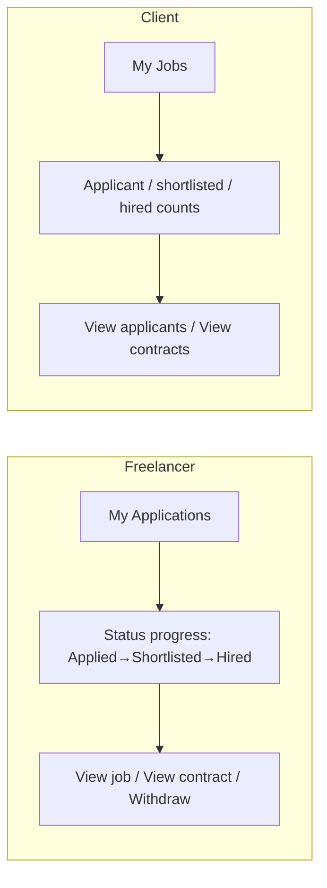

**Endpoints:** `GET /api/jobs/applications/my` (freelancer),
`GET /api/jobs/my-jobs` (client, enriched with counts).

---

## 15. Messaging

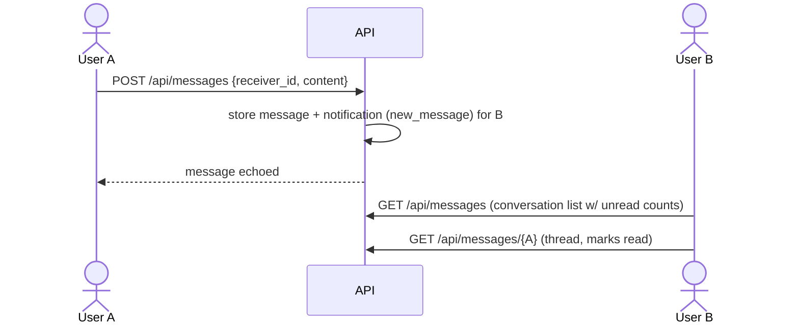

**Endpoints:** `GET /api/messages`, `GET /api/messages/{other_user_id}`,
`POST /api/messages`.

---

## 16. Social Feed

```mermaid
flowchart TD
    A[/feed] --> B[Create post: POST /api/posts]
    B --> C[Followers notified: new_post]
    A --> D[Like a post: POST /api/posts/id/like]
    D --> E[Author notified: like]
    A --> F[Follow users → personalised feed]
```

**Endpoints:** `POST/GET/DELETE /api/posts`, `GET /api/feed`,
`POST /api/posts/{id}/like`, `GET /api/posts/{id}/is-liked`.

---

## 17. Notifications

A single notification stream powers the **bell** (unread badge + dropdown) and the
`/notifications` page.

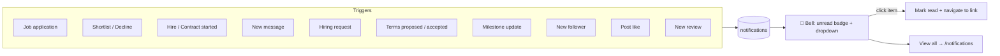

**Endpoints:** `GET /api/notifications`, `GET /api/notifications/unread-count`,
`PUT /api/notifications/{id}/read`, `PUT /api/notifications/read-all`.
The bell polls the unread count every ~45s.

---

## 18. Reviews & Ratings

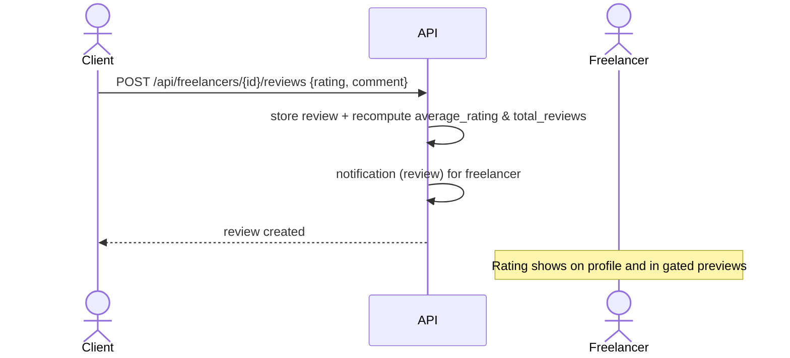

**Endpoints:** `POST /api/freelancers/{id}/reviews`, reviews returned with the profile.

---

## 19. Subscription / Membership (Stripe)

**Actor:** Freelancer (unlocks full job details + applying).

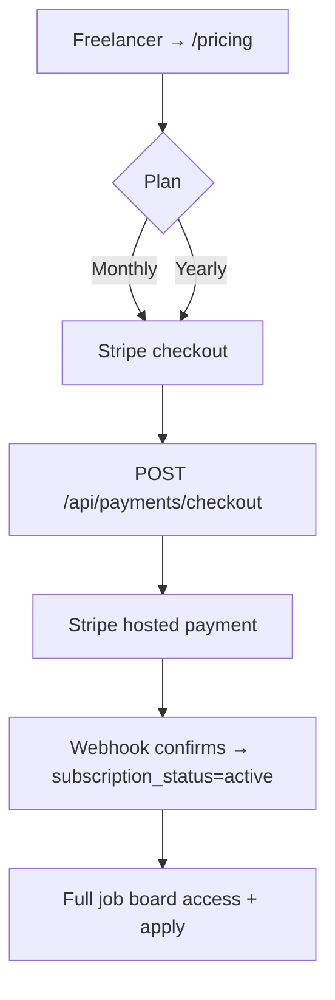

**Endpoints:** `POST /api/payments/checkout`, `GET /api/payments/status`,
Stripe webhook. **Note:** milestone/project payments are separate and currently
tracked-only.

---

## 20. Admin Console

```mermaid
flowchart LR
    A[/admin] --> B[Users: list, role, ban, delete]
    A --> C[Freelancers: feature, subscription]
    A --> D[Jobs: list, delete]
    A --> E[Categories: CRUD]
    A --> F[Stats & payments overview]
```

**Endpoints:** `GET /api/admin/stats`, `GET /api/admin/users`,
`PATCH /api/admin/users/{id}/role|status`, `DELETE /api/admin/users/{id}`,
`GET/DELETE /api/admin/freelancers`, `GET/DELETE /api/admin/jobs`,
`GET/POST/DELETE /api/admin/categories`, `GET /api/admin/payments`.

---

## 21. End-to-End Happy Path (job → delivery)

```mermaid
flowchart TD
    S1[Client posts job] --> S2[Freelancer applies with proposal]
    S2 --> S3[Client reviews applicants]
    S3 --> S4[Client hires → contract created]
    S4 --> S5[Parties agree terms & milestones]
    S5 --> S6[Fund → work → submit → approve → release per milestone]
    S6 --> S7[All milestones released → contract completed]
    S7 --> S8[Client leaves a review]
    S8 --> S9[Rating boosts freelancer profile]
```

Every arrow above raises a **notification** to the counterparty, surfaced through the bell.

---

### Legend / conventions
- **Notifications** are created server-side at each state change and appear in the bell.
- **Gating** = server-side redaction (`preview_only` / `requires_subscription`) for guests
  and unsubscribed freelancers — enforced in the API, not just the UI.
- **Tracked-only payments** = milestone fund/release change status only; no real money
  moves yet (planned Stripe escrow phase).
